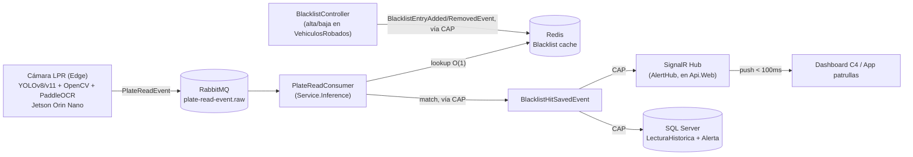

# Guía de Arquitectura — Sistema Municipal LPR/ANPR

> Audiencia: arquitectos, tech leads y stakeholders. Explica el **por qué** de cada decisión. Para el **qué** (esquemas, contratos, configuración) ver [TechnicalDocumentation.md](TechnicalDocumentation.md).

## 1. Visión general

El sistema captura y procesa en tiempo real flujos de video de cámaras instaladas en arcos de seguridad y avenidas de alta velocidad (hasta 160 km/h). Su objetivo principal es detectar matrículas (placas), cruzarlas inmediatamente (**< 300 ms**) contra una Lista Negra Municipal/Nacional de Vehículos con Reporte de Robo, y disparar alertas críticas a operadores en centros de mando (C4/C5) y a patrullas en campo.

## 2. Decisión de base de datos: enfoque híbrido políglota

| | SQL Server (principal) | Redis (cache caliente) |
|---|---|---|
| **Función** | Lista Negra auditada, logs LPR, usuarios/roles, catálogo de cámaras, reportes forenses | Copia en RAM de las placas activas en la Lista Negra |
| **Acceso** | Consultas administrativas, forenses, analíticas | Lookup `O(1)` por placa en el camino caliente |
| **Latencia** | N/A (fuera del camino caliente) | **< 2 ms** |
| **Por qué** | Transacciones ACID (auditoría de seguridad pública), `Columnstore Index` para forense, integración nativa con EF Core/Dapper | Único mecanismo capaz de sostener el presupuesto de < 300 ms bajo cientos de lecturas/seg |

**MySQL descartado:** SQL Server ofrece mejor soporte de concurrencia nativo para .NET y herramientas de auditoría corporativa esperadas por entes gubernamentales.
**MongoDB descartado:** la relación Auto → Alerta → Cámara → Operador es fija y relacional; un motor NoSQL no aporta flexibilidad aquí y pierde rendimiento frente a un lookup directo en Redis.

**Sincronización SQL Server → Redis:** no es solo el refresco periódico de 5 minutos del blueprint original — un alta de robo urgente no puede esperar ese ciclo. El diseño usa dos mecanismos:
1. **Invalidación inmediata event-driven** (`BlacklistEntryAddedEvent` / `BlacklistEntryRemovedEvent`) — se dispara al insertar/remover una fila en `VehiculosRobados`, propagando el cambio a Redis en segundos.
2. **Refresco delta periódico (5 min)** — como respaldo de reconciliación, no como mecanismo primario.

**Alimentación de `VehiculosRobados`:** los reportes de robo llegan por tres vías que traen los mismos datos — alta/baja manual de un operador, archivos Excel/`.txt`, y (a futuro) una API externa — todas convergiendo en un mismo servicio de reconciliación por placa antes de tocar SQL Server, para que las tres disparen exactamente el mismo mecanismo de invalidación de Redis descrito arriba. Detalle en [ImplementersGuide.md §11](ImplementersGuide.md#11-alimentación-de-la-lista-negra-vehiculosrobados).

## 3. Arquitectura de eventos y mensajería

Patrón **Event-Driven Architecture (EDA)** en C#/.NET para lograr latencias bajas y escalabilidad desacoplada:

**Tecnologías:**
- **RabbitMQ** — amortigua el tráfico de cámaras (publish/subscribe); si la BD se ralentiza, no se pierde un evento.
- **RabbitMQ.Client directo** para `PlateReadEvent` — el evento de mayor volumen del sistema (cientos por segundo). Se publica y consume por AMQP puro, con ack manual, sin pasar por ningún outbox transaccional: es una señal efímera sin escritura local que necesite atomicidad con el publish, así que no vale la pena pagar el costo de un outbox transaccional a este volumen.
- **DotNetCore.CAP** para el resto de los eventos (`BlacklistHitSavedEvent`, `BlacklistEntryAddedEvent`/`RemovedEvent`) — volumen bajo, se benefician de outbox transaccional (persistido en SQL Server), reintentos automáticos y agrupación de suscriptores por servicio (`DefaultGroupName`).
- **ASP.NET Core SignalR** — WebSocket persistente hacia C4 y la app móvil; push de alerta en < 100 ms, con backplane de Redis para escalar a múltiples instancias de `Api.Web`.

### Presupuesto de latencia (< 300 ms) y su riesgo principal

El diseño original embebía el crop de imagen en base64 dentro de `PlateReadEvent`. Se revisó: serializar y transmitir una imagen dentro del mensaje caliente de RabbitMQ compite directamente con el presupuesto de 300 ms. **Decisión:** el evento caliente solo lleva `ImageReference` (una clave/URL); la imagen se sube de forma asíncrona, fuera del camino crítico. El match contra Redis no necesita la imagen — solo la placa.

## 4. Modelo de Autenticación y Autorización

Separación explícita de responsabilidades — cada sistema es la única fuente de verdad de una cosa:

| | Keycloak | Casbin.NET |
|---|---|---|
| **Responsabilidad** | Autenticación: quién es el usuario, qué rol tiene | Autorización: qué puede hacer cada rol |
| **Por qué** | IAM centralizado y auditable con MFA nativo — relevante para un sistema de acceso a datos de seguridad pública; estándar OIDC soporta tanto el dashboard web como la app móvil de patrullas; único punto de identidad si se conecta con otros sistemas municipales (SSO) | Motor de políticas ligero, embebido en `Api.Web`, políticas persistidas en el mismo SQL Server ya usado por el resto del sistema |
| **Roles** | Emite `realm_access.roles` en el JWT | Evalúa `(rol, objeto, acción)` contra la tabla de políticas |

Roles: `SuperAdmin`, `SupervisorC4`, `OperadorC4`, `PatrullaMovil`, `AuditorForense`.

`Service.Inference` (worker interno de RabbitMQ) no requiere autenticación de usuario — no está expuesto por HTTP. El `AlertHub` (SignalR) valida el mismo JWT de Keycloak vía la query string de la conexión WebSocket.

Ver [TechnicalDocumentation.md](TechnicalDocumentation.md#autenticación-y-autorización) para el detalle de implementación y [ImplementersGuide.md](ImplementersGuide.md) para cómo configurar Keycloak.

## 5. Plan de contingencia y tolerancia a fallos

| Escenario | Mitigación |
|---|---|
| Pérdida de conexión a Internet/red municipal en un arco | El nodo Edge (Jetson) almacena lecturas en una cola SQLite local; al restablecer la red, descarga el buffer hacia RabbitMQ |
| Corte de energía / reinicio del servidor | Colas de RabbitMQ configuradas como persistentes (disco), no se pierden eventos en tránsito |
| Reintentos duplicando datos | `LecturaHistorica.EventId` es único (índice `IX_LecturasHistoricas_EventId`) — el consumer debe deduplicar por este id antes de insertar |
| Desincronía de la Lista Negra | Invalidación inmediata event-driven (sección 2) + refresco delta de 5 min como respaldo |
| Escalado de SignalR a múltiples instancias | Backplane de Redis (`Microsoft.AspNetCore.SignalR.StackExchangeRedis`, ya instalado) |

## 6. Stack tecnológico

- **Lenguaje/runtime:** C# / .NET 9 (LTS)
- **Backend:** ASP.NET Core Web API + SignalR Hubs + DotNetCore.CAP + RabbitMQ.Client
- **Edge:** Python (YOLOv8/v11 + OpenCV + PaddleOCR) sobre NVIDIA Jetson Orin Nano o PC industrial
- **Persistencia:** Dapper (inserciones masivas de alto rendimiento) + EF Core (gestión de usuarios/roles/admin, más compleja)
- **Bases de datos:** SQL Server 2022 + Redis
- **Frontend C4:** React o Angular con WebSockets activos (no seleccionado aún — pendiente)

## 7. Roadmap

| Fase | Contenido | Estado |
|---|---|---|
| Fase 0 | Infraestructura base (docker-compose, esqueleto de solución .NET) | ✅ Completa |
| Pre-Fase 1 | Modelo de Authentication/Authorization (Keycloak + Casbin.NET) | ✅ Completa |
| Fase 1 | Contratos de eventos + modelo de datos SQL Server | ✅ Completa |
| Fase 2 | Cache en Redis (`BlacklistCacheService`), mensajería (CAP + RabbitMQ.Client), `AlertHub` SignalR | ✅ Completa |
| Fase 3 | Simulador de carga (50 cámaras × 10 lecturas/seg) + módulo Edge Python/YOLO | 🔶 En progreso |

Detalle de estado de implementación real (qué archivos existen hoy) en [TechnicalDocumentation.md](TechnicalDocumentation.md).
